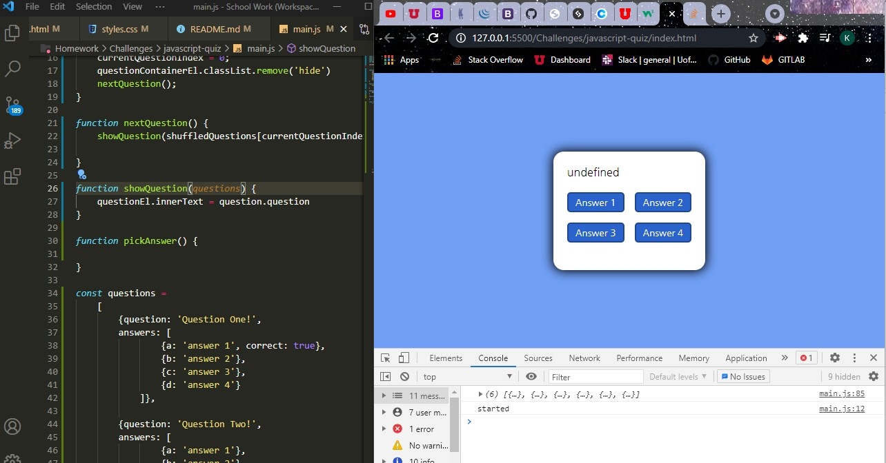
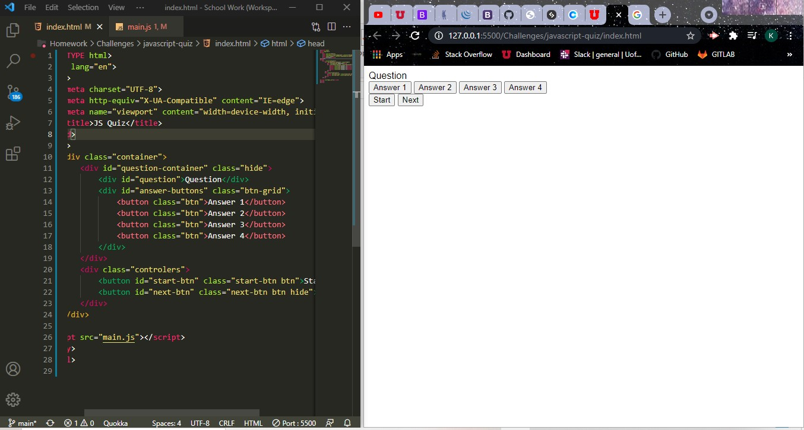

# Challenge 4- Timed Test Application 
> Lets take a Web Development Quiz!
---
### Table of Contents
- [Description](#description)
- [Introduction](#introduction)
- [Challenges](#challenges)
- [Victories](#victories)
- [Resources](#resources)

---

## Description

Challenge #4- Timed quiz generator 

## Introduction 
This week we were challenged to create a timed quiz.

---

## Challenges
Javascript as a whole has been a huge challange for me to try and overcome.

---

I started to set up the bones of my JS file, i was trying to push my question array into my question element within my HTML and i ran into quite a few snags with that.

---

## Victories

---
I feel like ive really grasped the concept of HTML and CSS. This part is usually the most enjoyable for me.

---

## Resources 

<a href="#">GitHub Repo</a>

<a href="https://www.youtube.com/watch?v=eVGEea7adDM">ReadMe Template-YouTube</a>

<a href="https://www.google.com/webhp?hl=en&sa=X&ved=0ahUKEwiLjJ7fosLvAhWXW80KHawRD_oQPAgI">Google</a>

<a href="https://www.w3schools.com/css/css_grid_container.asp">CSS Grid W3 Schools</a>

<a href="https://coolors.co/">Coolors</a>