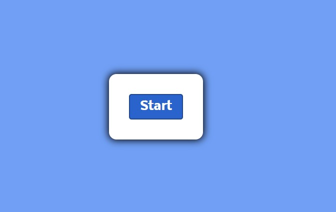
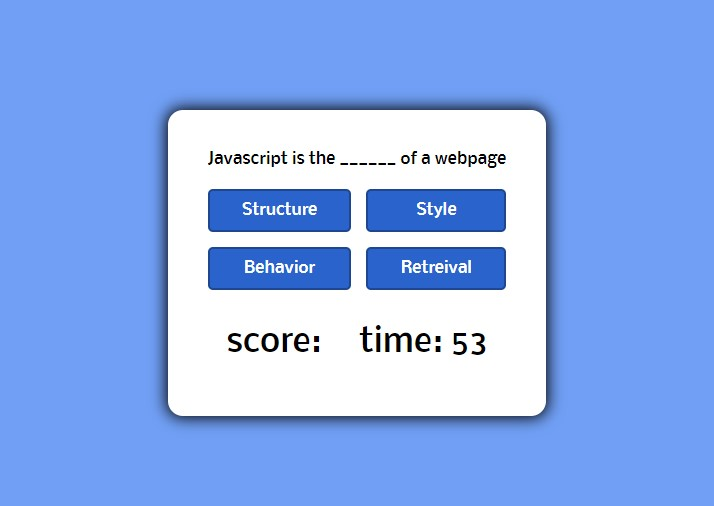
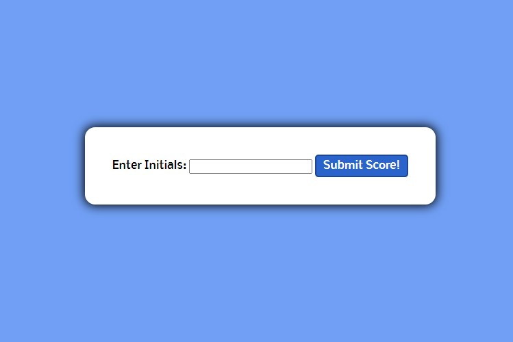
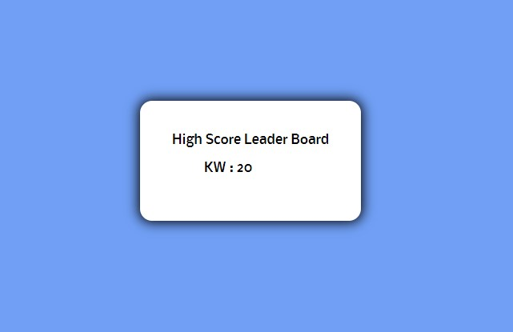

# Challenge 4- Timed Test Application 
> Lets take a Web Development Quiz!
---
### Table of Contents
- [Description](#description)
- [Introduction](#introduction)
- [Challenges](#challenges)
- [Victories](#victories)
- [Resources](#resources)

---

## Description

Challenge #4- Timed quiz generator 

## Introduction 
This week we were challenged to create a timed quiz.

---

## Challenges
Javascript as a whole has been a huge challange for me to try and overcome.

---

I started to set up the bones of my JS file, i was trying to push my question array into my question element within my HTML and i ran into quite a few snags with that.

---

---

Towards the end i ran into issues with my questions skipping objects in the array. Thankfully eric was able to help me troubleshoot that and figure out that we had a click event set up wrong to start over on the count of questions each time and thus skip over one, then two, then three.

---

Another challenge i faced when i was trying to google issues that i came across was the lack of straight vanilla javascript. A lot of the resources i found that made sense used a combo of vanilla and jquery, so that was challening to not be able to use jquery at all.

## Victories

## Finished Product

---
I feel like ive really grasped the concept of HTML and CSS. This part is usually the most enjoyable for me.

---

Thank goodness i was able to figure out how to make this web app succesfull. I was able to easily manipulate dom items to add and remove class's of hide so i could keep all of my content on one html page with many differnt viewable div's.

---

Overall this was an extremely challenging assignment. It really did push me out of my comfort zone, and really taught me how to start from scratch with all the basics and really be able to tie them all together and make it one finished product!

## Resources 

<a href="#">GitHub Repo</a>

<a href="https://www.youtube.com/watch?v=eVGEea7adDM">ReadMe Template-YouTube</a>

<a href="https://www.google.com/webhp?hl=en&sa=X&ved=0ahUKEwiLjJ7fosLvAhWXW80KHawRD_oQPAgI">Google</a>

<a href="https://www.w3schools.com/css/css_grid_container.asp">CSS Grid W3 Schools</a>

